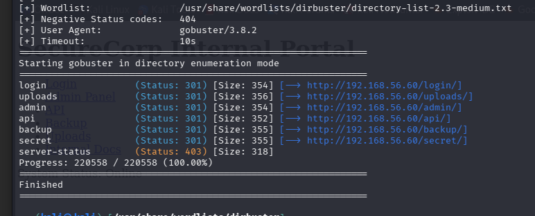
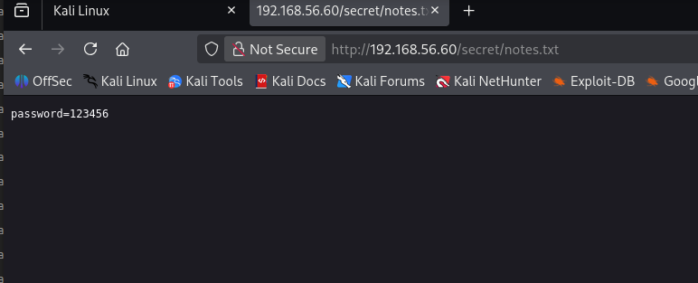
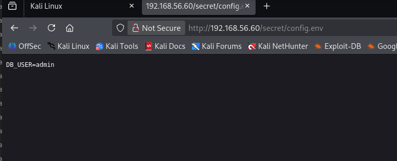
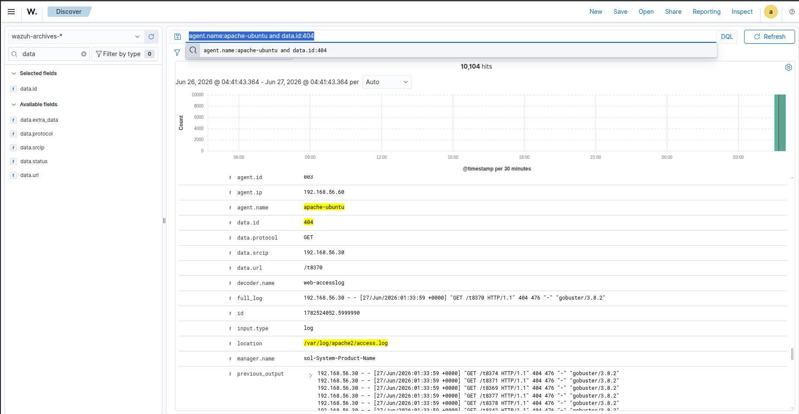
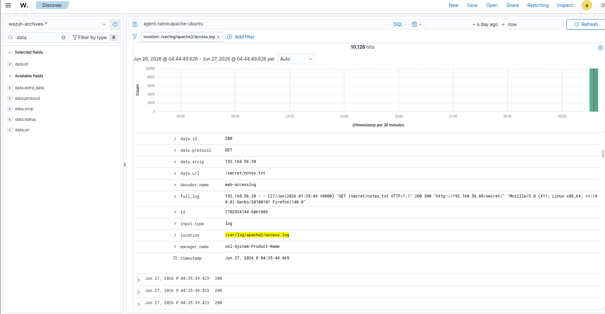

# SOC Lab Attack Scenarios

This document describes the attack simulations performed in the lab and how Wazuh detected and generated alerts from them.

---

## Scenario 1: Web Enumeration (Kali Linux - Gobuster)

### A Kali Linux machine was used to perform directory enumeration against a target system using Gobuster.

### on terminal

run:

```
nmap 192.168.56.0/24

```


found http  service open on 192.168.56.30


We try  **Directory enumeration** using gobuster
```
gobuster dir -u 192.168.56.60 -w /usr/share/wordlists/dirbuster/directory-list-2.3-medium.txt
```



we found  these directories we navigate  to them to find something we can use to exploit 

in secret  directory we found  password  



and also we found a DB user that use that password




Detection Signals

The following indicators were observed:

- Large number of HTTP 404 responses (Not Found)
- Sudden appearance of HTTP 200 responses on hidden endpoints
- Repeated requests to multiple directories in a short time  from a kali linux machine using go buster




---

## Investigation Process

By analyzing the Wazuh alerts and web logs, it was identified that:

- The attacker discovered a hidden directory
- The directory contained sensitive information (e.g., password/config file)
- Access to this endpoint returned HTTP 200 after enumeration attempts



---

## Result

- Attack was successfully detected through log analysis
- Wazuh correlated multiple failed and successful requests
- Suspicious pattern was flagged as directory enumeration activity


The collected events were correlated in the Wazuh Dashboard, allowing the attack sequence to be monitored from initial access to post-compromise enumeration.

These alerts demonstrate Wazuh's ability to detect and monitor suspicious remote administration and post-access activity in real time.

