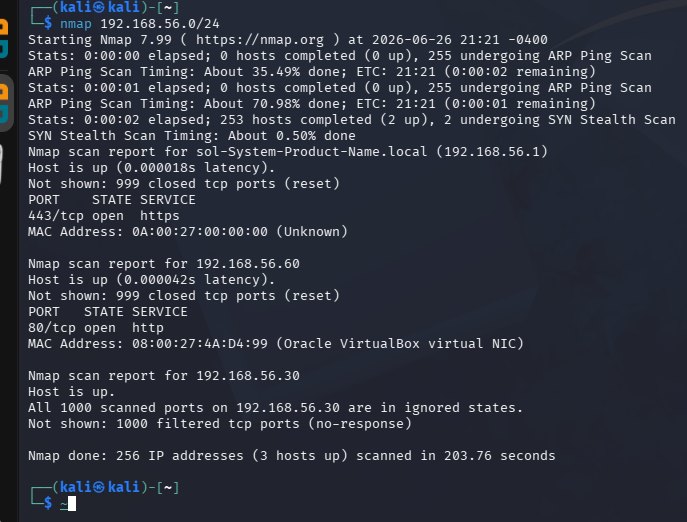

# SOC Lab Attack Scenarios

This document describes the attack simulations performed in the lab and how Wazuh detected and generated alerts from them.

---

## Scenario 1: Web Enumeration (Kali Linux - Gobuster)

### A Kali Linux machine was used to perform directory enumeration against a target system using Gobuster.

### on terminal

run:

```
nmap 192.168.56.0/24

```




found http  service open on 192.168.56.30


We try  **Directory enumeration** using gobuster


we found  these directories we navigate  to them to found somethings


in secret we found  password  


