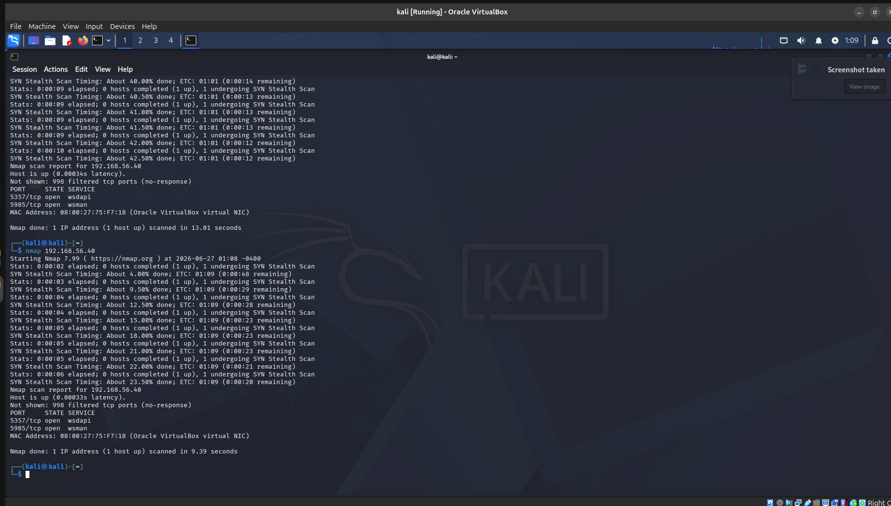
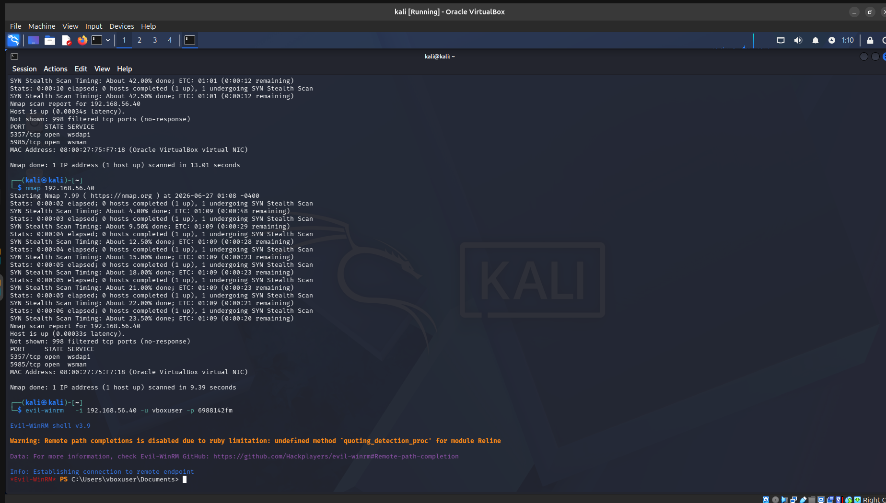
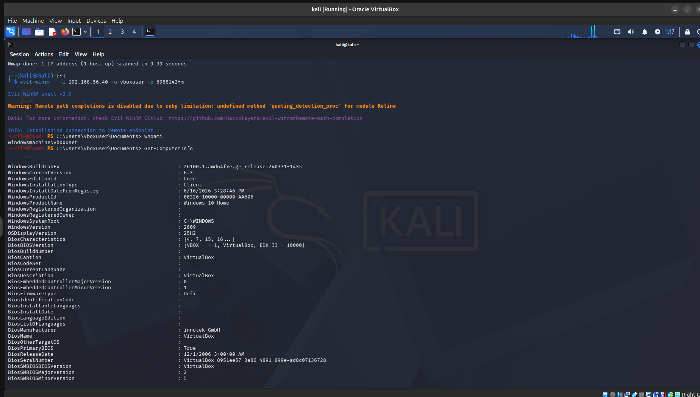
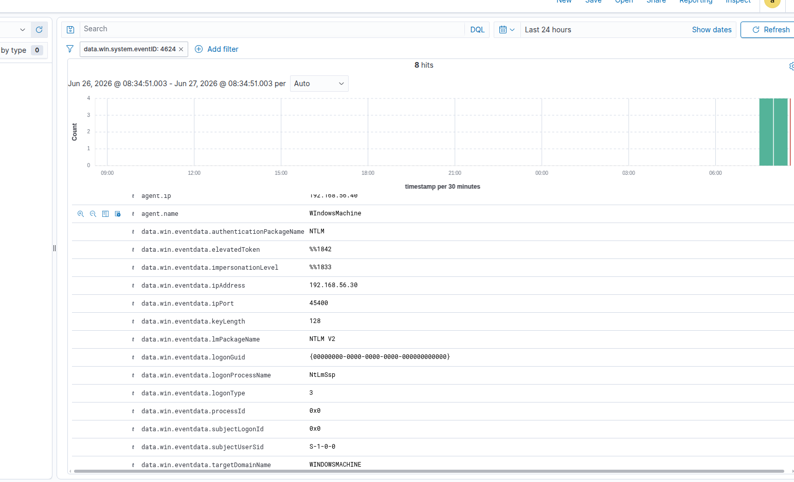
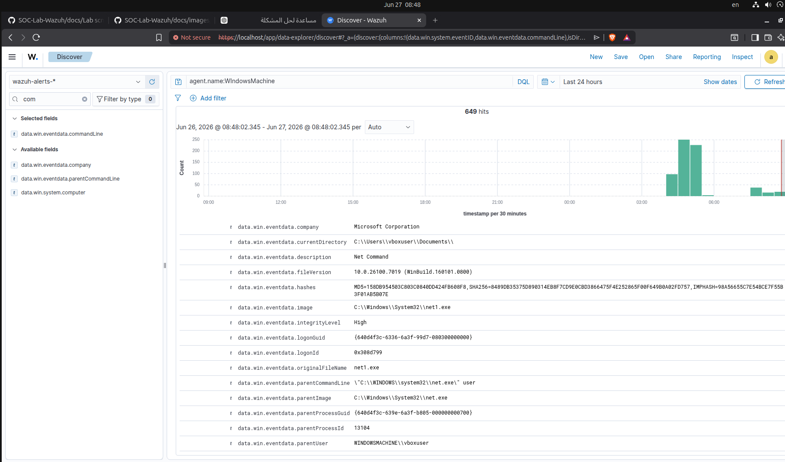

 # SOC Lab Attack Scenarios

This document describes the attack simulations performed in the lab and how Wazuh detected and generated alerts from them.

---


## Scenario 2: Windows Powershell access (kali -Evilwinrm)


on terminal 
```
nmap 192.168.56.40
```




The scan results revealed two exposed services on the target Windows machine:

- 5357/tcp (WSDAPI) — Windows device discovery service, not relevant for exploitation  
- 5985/tcp (WinRM) — Windows Remote Management service used for remote PowerShell access

---

Using valid credentials (username and password), access to the Windows machine was established through the exposed WinRM service (port 5985).

A remote PowerShell session was initiated, allowing interaction with the system from the Kali Linux machine.



---


## Post-Access Activity

After gaining access, basic system enumeration was performed using PowerShell commands to understand the internal environment of the machine.

The following commands were used:

```powershell
whoami
Get-ComputerInfo
net user

```




## Detection in Wazuh

Wazuh successfully detected the activities performed during the attack simulation.

The following events were observed:

Successful Windows logon (Event ID 4624 - Logon Type 3), indicating remote network authentication.




--- 




PowerShell execution events generated after establishing the remote session.
Sysmon Process Creation events showing PowerShell activity on the Windows endpoint.


The collected events were correlated in the Wazuh Dashboard, allowing the attack sequence to be monitored from initial access to post-compromise enumeration.

These alerts demonstrate Wazuh's ability to detect and monitor suspicious remote administration and post-access activity in real time.

ذذ
