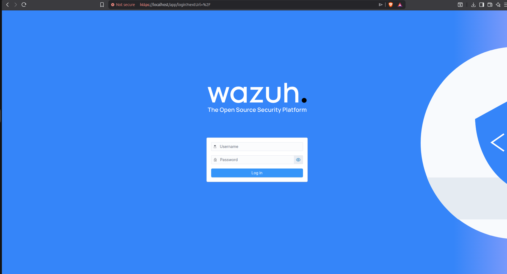

# Wazuh Installation & Setup Guide

## Installing  Wazuh on the host machine (iam using ubuntu )

open a terminal  and use
```
curl -sO https://packages.wazuh.com/4.13/wazuh-install.sh

sudo bash wazuh-install.sh -a
```

This installs:

- Wazuh Manager
- Indexer
- Dashboard

on the same machine. after installation is finished: 

The script prints:

```
Dashboard URL
Username
Password
```

Verifying  That Wazuh is working before  installing  Agents

### 1. Check Wazuh services

Run:

```
sudo systemctl status wazuh-manager
sudo systemctl status wazuh-indexer
sudo systemctl status wazuh-dashboard
```

You should see active


### 2.Checking if Wazuh is listening on all interfaces

On your Ubuntu host:

```
sudo ss -tlnp | grep -E '1514|1515|443'
```


## 3.Open The dashboard

#### The dashboard can still be accessed from:

```
https://localhost
```



#### on the Ubuntu host itself.

And from the VMs, the agents would communicate to:

```
192.168.56.1
```

if u  want to start it  If its inactive


```
sudo systemctl start wazuh-manager
sudo systemctl start wazuh-indexer
sudo systemctl start wazuh-dashboard
```

#### If a service is **disabled**, enable it so it starts on future boots:

```
sudo systemctl enable wazuh-manager
sudo systemctl enable wazuh-indexer
sudo systemctl enable wazuh-dashboard
```


#### To both enable and start immediately:

```
sudo systemctl enable --now wazuh-manager
sudo systemctl enable --now wazuh-indexer
sudo systemctl enable --now wazuh-dashboard
```


## to open Wazuh  agent manager

/var/ossec/bin/manage_agents


# Enabling Archive  ( writing all  logs/events )
### 1. Wazuh Manager (`ossec.conf`)

We made sure Wazuh writes all events to the archives log by enabling:

```
<global>  <logall_json>yes</logall_json></global>
```

This causes Wazuh Manager to write events to:

```
/var/ossec/logs/archives/archives.json
```


### 2. Filebeat Wazuh module (`/etc/filebeat/modules.d/wazuh.yml`)

Originally you had:

```
- module: wazuh  archives:    enabled: true
```

We changed it to:

```
- module: wazuh  alerts:    enabled: true  archives:    enabled: true
```


### 3. Restarted services

After the changes, Filebeat had to be restarted:

```
sudo systemctl restart filebeat
```

and if `ossec.conf` was modified:

```
sudo systemctl restart wazuh-manager
```

---

### How to verify archives are enabled now


```
curl -k -u user:passowrd https://127.0.0.1:9200/_cat/indices?v
```


##   How to add indexes in dashboard search

```
Dashboard management >   > index patterns  > click create indix pattern   >  wazuh-archives-*

'''

